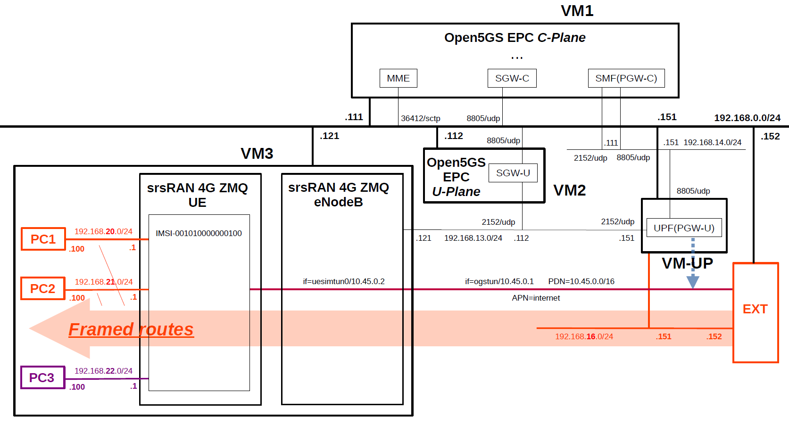
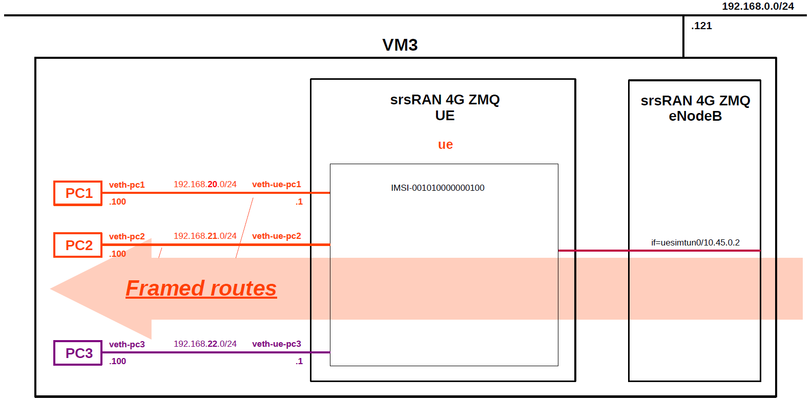

# Open5GS EPC & srsRAN_4G with ZeroMQ UE / RAN Sample Configuration - Framed Routing with Open5GS UPF(PGW-U)
This describes a very simple configuration that uses Open5GS and srsRAN_4G with ZeroMQ UE / RAN for Framed Routing.

First of all, the 5GC Framed Routing feature was merged into Open5GS via the following pull request by **@mitmitmitm**.

- [Framed routing](https://github.com/open5gs/open5gs/pull/2009)
- [Framed routes udr](https://github.com/open5gs/open5gs/pull/2022)
- [[SMF/PFCP] Send framed routes in both UL and DL pdrs](https://github.com/open5gs/open5gs/pull/2356)

The related documents can be found below.
- https://github.com/gonalobastos/5G-Framed-Routing

The code to add 4G EPC Framed Routing support to this feature has been submitted as a pull request below by **@cecrevier**.
- [fix: support framed routes over EPC Gx](https://github.com/open5gs/open5gs/pull/4757)

---

### [Sample Configurations and Miscellaneous for Mobile Network](https://github.com/s5uishida/sample_config_misc_for_mobile_network)

---

<a id="toc"></a>

## Table of Contents

- [Overview of Open5GS CUPS-enabled EPC Simulation Mobile Network](#overview)
- [Changes in configuration files of Open5GS EPC and srsRAN_4G ZMQ UE / RAN](#changes)
  - [Changes in configuration files of Open5GS EPC C-Plane](#changes_cp)
  - [Changes in configuration files of Open5GS EPC U-Plane (SGW-U)](#changes_sgwu)
  - [Changes in configuration files of Open5GS EPC U-Plane (PGW-U)](#changes_pgwu)
  - [Changes in configuration files of srsRAN_4G ZMQ UE / RAN](#changes_srs)
    - [Changes in configuration files of RAN](#changes_ran)
    - [Changes in configuration files of UE](#changes_ue)
- [Network settings of Open5GS EPC and srsRAN_4G ZMQ UE / RAN](#network_settings)
  - [Network settings of Open5GS EPC U-Plane (PGW-U)](#network_settings_pgwu)
  - [Network settings of External Node](#network_settings_ext)
  - [Network settings of VM3](#network_settings_vm3)
    - [Add netns](#add_netns)
    - [Setup veth pair for UE and PC1/PC2/PC3](#setup_ue)
- [Add Framed Routes to Subscriber information](#add_framed_routes)
  - [Add Framed Routes to UE](#add_framed_routes_ue)
- [Build Open5GS and srsRAN_4G ZMQ UE / RAN](#build)
- [Run Open5GS EPC and srsRAN_4G ZMQ UE / RAN](#run)
  - [Run Open5GS EPC C-Plane](#run_cp)
  - [Run Open5GS EPC U-Plane (SGW-U)](#run_sgwu)
  - [Run Open5GS EPC U-Plane (PGW-U)](#run_pgwu)
  - [Run srsRAN_4G ZMQ RAN](#run_ran)
  - [Run srsRAN_4G ZMQ UE](#run_ue)
  - [Run tcpdump on PC1](#run_pc1)
  - [Run tcpdump on PC2](#run_pc2)
  - [Run tcpdump on PC3](#run_pc3)
- [Ping Framed Routes](#ping)
  - [Ping IP address (192.168.20.100/24) of Framed Routes of UE on PC1](#ping_pc1)
  - [Ping IP address (192.168.21.100/24) of Framed Routes of UE on PC2](#ping_pc2)
  - [Ping IP address (192.168.22.100/24) not configured for Framed Routes](#ping_pc3)
- [Changelog (summary)](#changelog)

---

<a id="overview"></a>

## Overview of Open5GS CUPS-enabled EPC Simulation Mobile Network

I created a CUPS-enabled EPC mobile network for the purpose of using  the IP routes (Framed Routes) behind the UE.

The following minimum configuration was set as a condition.
- One UE has two Framed Routes. On the UPF VM, make sure to be able to ping the Framed Routes via the IP address (Tunnel GW/tun_srsue) assigned to UE.
- Confirm not to be able to ping to a network that is not configured in the Framed Routes.

The built simulation environment is as follows.
**According to [this](https://docs.srsran.com/projects/4g/en/latest/app_notes/source/zeromq/source/index.html#known-issues), srsRAN_4G ZMQ supports only one eNodeB and one UE, so I have confirmed the operation with the following configuration.**

</img>

The following figure shows the netns and veth pairs within VM3.

</img>

The EPC / UE / RAN used are as follows.
- EPC - Open5GS v2.8.0(+[patch](https://github.com/open5gs/open5gs/pull/4757)) (2026.09.03) - https://github.com/open5gs/open5gs
- UE / RAN - srsRAN_4G (2026.01.18) - https://github.com/srsran/srsRAN_4G

Each VMs are as follows.  
| VM # | SW & Role | IP address | OS | CPU<br>(Min) | Mem<br>(Min) | HDD<br>(Min) |
| --- | --- | --- | --- | --- | --- | --- |
| VM1 | Open5GS EPC C-Plane | 192.168.0.111/24<br>192.168.14.111/24 | Ubuntu 24.04 | 1 | 2GB | 20GB |
| VM2 | Open5GS EPC U-Plane (SGW-U)  | 192.168.0.112/24<br>192.168.13.151/24 | Ubuntu 24.04 | 1 | 1GB | 10GB |
| VM-UP | Open5GS EPC U-Plane (PGW-U)  | 192.168.0.151/24<br>192.168.13.151/24<br>192.168.14.151/24<br>**192.168.16.151/24** | Ubuntu 24.04 | 1 | 1GB | 10GB |
| EXT | External Node | 192.168.0.152/24<br>**192.168.16.152/24** | Ubuntu 24.04 | 1 | 1GB | 10GB |
| VM3 | srsRAN_4G ZMQ RAN (eNodeB) | 192.168.0.121/24<br>192.168.13.121/24 | Ubuntu 24.04 | 1 | 4GB | 10GB |
|| srsRAN_4G ZMQ UE | **192.168.20.1/24<br>192.168.21.1/24<br>192.168.22.1/24** | -- | -- | -- | -- |
|| PC1 Internal Node | **192.168.20.100/24** | -- | -- | -- | -- |
|| PC2 Internal Node | **192.168.21.100/24** | -- | -- | -- | -- |
|| PC3 Internal Node | **192.168.22.100/24** | -- | -- | -- | -- |

Pairs of network namespaces and virtual network interfaces are follows.
| Role | netns | veth | veth | netns | Role |
| --- | --- | --- | --- | --- | --- |
| UE | ue | veth-ue-pc1<br>**192.168.20.1/24** | veth-pc1<br>**192.168.20.100/24** | pc1 | PC1 |
||| veth-ue-pc2<br>**192.168.21.1/24** | veth-pc2<br>**192.168.21.100/24** | pc2 | PC2 |
||| veth-ue-pc3<br>**192.168.22.1/24** | veth-pc3<br>**192.168.22.100/24** | pc3 | PC3 |

Subscriber Information (other information is the same) is as follows.  
**Note. Please select OP or OPc according to the setting of srsRAN_4G UE configuration files. As of 2023.01.29, Framed Routes cannot be set with the WebUI. Also, if you change the `open5gs-dbctl` script, it seems that you can register these with this script, but I could not register.**
| UE # | IMSI | APN | OP/OPc | Framed Routes | Internal IP address |
| --- | --- | --- | --- | --- | --- |
| UE | 001010000000100 | internet | OPc | **192.168.20.0/24<br>192.168.21.0/24** | **192.168.20.1<br>192.168.21.1** |

**Note. <ins>192.168.22.0/24</ins> is not configured for Framed Routes.**

I registered these information with the Open5GS WebUI.
In addition, [3GPP TS 35.208](https://www.3gpp.org/DynaReport/35208.htm) "4.3 Test Sets" is published by 3GPP as test data for the 3GPP authentication and key generation functions (MILENAGE).

PDN is as follows.
| PDN | TUNnel interface of PDN | APN | TUNnel interface of UE |
| --- | --- | --- | --- |
| 10.45.0.0/16 | ogstun | internet | tun_srsue |

<a id="changes"></a>

## Changes in configuration files of Open5GS EPC and srsRAN_4G ZMQ UE / RAN

Please refer to the following for building Open5GS and srsRAN_4G ZMQ UE / RAN respectively.
- Open5GS v2.8.0(+[patch](https://github.com/open5gs/open5gs/pull/4757)) (2026.09.03) - https://open5gs.org/open5gs/docs/guide/02-building-open5gs-from-sources/
- srsRAN_4G (2026.01.18) - https://github.com/s5uishida/build_srsran_4g_zmq_disable_rf_plugins

<a id="changes_cp"></a>

### Changes in configuration files of Open5GS EPC C-Plane

- `open5gs/install/etc/open5gs/mme.yaml`
```diff
--- mme.yaml.orig       2026-08-08 20:47:51.000000000 +0900
+++ mme.yaml    2026-08-22 06:18:08.414256875 +0900
@@ -12,7 +12,7 @@
   freeDiameter: /root/open5gs/install/etc/freeDiameter/mme.conf
   s1ap:
     server:
-      - address: 127.0.0.2
+      - address: 192.168.0.111
   gtpc:
     server:
       - address: 127.0.0.2
@@ -27,14 +27,14 @@
         port: 9090
   gummei:
     - plmn_id:
-        mcc: 999
-        mnc: 70
+        mcc: 001
+        mnc: 01
       mme_gid: 2
       mme_code: 1
   tai:
     - plmn_id:
-        mcc: 999
-        mnc: 70
+        mcc: 001
+        mnc: 01
       tac: 1
   security:
     integrity_order : [ EIA2, EIA1, EIA0 ]
```
- `open5gs/install/etc/open5gs/sgwc.yaml`
```diff
--- sgwc.yaml.orig      2025-01-15 04:12:06.000000000 +0900
+++ sgwc.yaml   2025-12-14 00:16:53.080371526 +0900
@@ -14,10 +14,11 @@
       - address: 127.0.0.3
   pfcp:
     server:
-      - address: 127.0.0.3
+      - address: 192.168.0.111
     client:
       sgwu:
-        - address: 127.0.0.6
+        - address: 192.168.0.112
+          apn: internet
 
 ################################################################################
 # GTP-C Server
```
- `open5gs/install/etc/open5gs/smf.yaml`
```diff
--- smf.yaml.orig       2025-01-15 04:12:06.000000000 +0900
+++ smf.yaml    2025-01-15 04:26:29.000000000 +0900
@@ -9,27 +9,19 @@
 #    peer: 64
 
 smf:
-  sbi:
-    server:
-      - address: 127.0.0.4
-        port: 7777
-    client:
-#      nrf:
-#        - uri: http://127.0.0.10:7777
-      scp:
-        - uri: http://127.0.0.200:7777
   pfcp:
     server:
-      - address: 127.0.0.4
+      - address: 192.168.14.111
     client:
       upf:
-        - address: 127.0.0.7
+        - address: 192.168.14.151
+          dnn: internet
   gtpc:
     server:
       - address: 127.0.0.4
   gtpu:
     server:
-      - address: 127.0.0.4
+      - address: 192.168.14.111
   metrics:
     server:
       - address: 127.0.0.4
@@ -37,13 +29,10 @@
   session:
     - subnet: 10.45.0.0/16
       gateway: 10.45.0.1
-    - subnet: 2001:db8:cafe::/48
-      gateway: 2001:db8:cafe::1
+      dnn: internet
   dns:
     - 8.8.8.8
     - 8.8.4.4
-    - 2001:4860:4860::8888
-    - 2001:4860:4860::8844
   mtu: 1400
 #  p-cscf:
 #    - 127.0.0.1
```

<a id="changes_sgwu"></a>

### Changes in configuration files of Open5GS EPC U-Plane (SGW-U)

- `open5gs/install/etc/open5gs/sgwu.yaml`
```diff
--- sgwu.yaml.orig      2025-11-20 05:59:10.000000000 +0900
+++ sgwu.yaml   2026-08-30 21:02:44.705000000 +0900
@@ -11,13 +11,13 @@
 sgwu:
   pfcp:
     server:
-      - address: 127.0.0.6
+      - address: 192.168.0.112
     client:
 #      sgwc:    # SGW-U PFCP Client try to associate SGW-C PFCP Server
 #        - address: 127.0.0.3
   gtpu:
     server:
-      - address: 127.0.0.6
+      - address: 192.168.13.112
 
 ################################################################################
 # PFCP Server
```

<a id="changes_pgwu"></a>

### Changes in configuration files of Open5GS EPC U-Plane (PGW-U)

- `open5gs/install/etc/open5gs/upf.yaml`
```diff
--- upf.yaml.orig       2024-05-02 19:52:00.000000000 +0900
+++ upf.yaml    2024-05-19 12:38:00.000000000 +0900
@@ -11,18 +11,18 @@
 upf:
   pfcp:
     server:
-      - address: 127.0.0.7
+      - address: 192.168.14.151
     client:
 #      smf:     #  UPF PFCP Client try to associate SMF PFCP Server
 #        - address: 127.0.0.4
   gtpu:
     server:
-      - address: 127.0.0.7
+      - address: 192.168.13.151
   session:
     - subnet: 10.45.0.0/16
       gateway: 10.45.0.1
-    - subnet: 2001:db8:cafe::/48
-      gateway: 2001:db8:cafe::1
+      dnn: internet
+      dev: ogstun
   metrics:
     server:
       - address: 127.0.0.7
```

<a id="changes_srs"></a>

### Changes in configuration files of srsRAN_4G ZMQ UE / RAN

<a id="changes_ran"></a>

#### Changes in configuration files of RAN

- `srsRAN_4G/build/srsenb/enb.conf`
```diff
--- enb.conf.example    2026-01-26 19:35:53.000000000 +0900
+++ enb.conf    2026-08-30 19:20:36.140807186 +0900
@@ -22,9 +22,9 @@
 enb_id = 0x19B
 mcc = 001
 mnc = 01
-mme_addr = 127.0.1.100
-gtp_bind_addr = 127.0.1.1
-s1c_bind_addr = 127.0.1.1
+mme_addr = 192.168.0.111
+gtp_bind_addr = 192.168.13.121
+s1c_bind_addr = 192.168.0.121
 s1c_bind_port = 0
 n_prb = 50
 #tm = 4
@@ -80,8 +80,8 @@
 #time_adv_nsamples = auto
 
 # Example for ZMQ-based operation with TCP transport for I/Q samples
-#device_name = zmq
-#device_args = fail_on_disconnect=true,tx_port=tcp://*:2000,rx_port=tcp://localhost:2001,id=enb,base_srate=23.04e6
+device_name = zmq
+device_args = fail_on_disconnect=true,tx_port=tcp://*:2000,rx_port=tcp://localhost:2001,id=enb,base_srate=23.04e6
 
 #####################################################################
 # Packet capture configuration
```
- `srsRAN_4G/build/srsenb/rr.conf`
```diff
--- rr.conf.example     2026-01-26 19:35:53.000000000 +0900
+++ rr.conf     2026-08-30 19:21:35.330011268 +0900
@@ -55,7 +55,7 @@
   {
     // rf_port = 0;
     cell_id = 0x01;
-    tac = 0x0007;
+    tac = 0x0001;
     pci = 1;
     // root_seq_idx = 204;
     dl_earfcn = 3350;
```

<a id="changes_ue"></a>

#### Changes in configuration files of UE

- `srsRAN_4G/build/srsue/ue.conf`
```diff
--- ue.conf.example     2026-01-26 19:35:53.000000000 +0900
+++ ue.conf     2026-09-01 20:22:07.348239594 +0900
@@ -42,8 +42,8 @@
 #continuous_tx     = auto
 
 # Example for ZMQ-based operation with TCP transport for I/Q samples
-#device_name = zmq
-#device_args = tx_port=tcp://*:2001,rx_port=tcp://localhost:2000,id=ue,base_srate=23.04e6
+device_name = zmq
+device_args = tx_port=tcp://*:2001,rx_port=tcp://localhost:2000,id=ue,base_srate=23.04e6
 
 #####################################################################
 # EUTRA RAT configuration
@@ -139,9 +139,9 @@
 [usim]
 mode = soft
 algo = milenage
-opc  = 63BFA50EE6523365FF14C1F45F88737D
-k    = 00112233445566778899aabbccddeeff
-imsi = 001010123456780
+opc  = E8ED289DEBA952E4283B54E88E6183CA
+k    = 465B5CE8B199B49FAA5F0A2EE238A6BC
+imsi = 001010000000100
 imei = 353490069873319
 #reader =
 #pin  = 1234
@@ -180,8 +180,8 @@
 #                      Supported: 0 - NULL, 1 - Snow3G, 2 - AES, 3 - ZUC
 #####################################################################
 [nas]
-#apn = internetinternet
-#apn_protocol = ipv4
+apn = internet
+apn_protocol = ipv4
 #user = srsuser
 #pass = srspass
 #force_imsi_attach = false
@@ -208,7 +208,7 @@
 # ip_netmask:           Netmask of the tun_srsue device. Default: 255.255.255.0
 #####################################################################
 [gw]
-#netns =
+netns = ue
 #ip_devname = tun_srsue
 #ip_netmask = 255.255.255.0
 
```

<a id="network_settings"></a>

## Network settings of Open5GS EPC and srsRAN_4G ZMQ UE / RAN

<a id="network_settings_pgwu"></a>

### Network settings of Open5GS EPC U-Plane (PGW-U)

First, uncomment the next line in the `/etc/sysctl.conf` file and reflect it in the OS.
```
net.ipv4.ip_forward=1
```
```
# sysctl -p
```
Next, configure the TUNnel interface and set the routings towards Framed Routes.
```
ip tuntap add name ogstun mode tun
ip addr add 10.45.0.1/16 dev ogstun
ip link set ogstun up

ip route add 192.168.20.0/24 dev ogstun
ip route add 192.168.21.0/24 dev ogstun
ip route add 192.168.22.0/24 dev ogstun
```

<a id="network_settings_ext"></a>

### Network settings of External Node

Set the routings towards UEs and Framed Routes.
```
ip route add 10.45.0.0/16 via 192.168.16.151
ip route add 192.168.20.0/24 via 192.168.16.151
ip route add 192.168.21.0/24 via 192.168.16.151
ip route add 192.168.22.0/24 via 192.168.16.151
```

<a id="network_settings_vm3"></a>

### Network settings of VM3

Delete default GW.
```
# ip route del default
```

<a id="add_netns"></a>

#### Add netns

First, create the following netns for the UE and the terminals.
```
ip netns add ue
ip netns add pc1
ip netns add pc2
ip netns add pc3
```

<a id="setup_ue"></a>

#### Setup veth pair for UE and PC1/PC2/PC3

First, move to `netns:ue`.
```
ip netns exec ue bash
```
Enable IP forwarding.
```
sysctl -w net.ipv4.ip_forward=1
```
Create `veth-ue-pc1` and `veth-pc1`, then move `veth-pc1` to netns:`pc1`. Assign `192.168.20.1/24` to `veth-ue-pc1` and enable `veth-ue-pc1`.
```
ip link add veth-ue-pc1 type veth peer name veth-pc1
ip link set veth-pc1 netns pc1
ip addr add 192.168.20.1/24 dev veth-ue-pc1
ip link set veth-ue-pc1 up
```
Similarly, create `veth-ue-pc2` and `veth-pc2`, then move `veth-pc2` to netns:`pc2`. Assign `192.168.21.1/24` to `veth-ue-pc2` and enable `veth-ue-pc2`.
```
ip link add veth-ue-pc2 type veth peer name veth-pc2
ip link set veth-pc2 netns pc2
ip addr add 192.168.21.1/24 dev veth-ue-pc2
ip link set veth-ue-pc2 up
```
Similarly, create `veth-ue-pc3` and `veth-pc3`, then move `veth-pc3` to netns:`pc3`. Assign `192.168.22.1/24` to `veth-ue-pc3` and enable `veth-ue-pc3`.
```
ip link add veth-ue-pc3 type veth peer name veth-pc3
ip link set veth-pc3 netns pc3
ip addr add 192.168.22.1/24 dev veth-ue-pc3
ip link set veth-ue-pc3 up
```
Next, move to netns:`pc1`.
```
ip netns exec pc1 bash
```
Assign `192.168.20.100/24` ​​to `veth-pc1` and enable `veth-pc1`. Then, set `192.168.20.1` as the default route. Finally, enable interface `lo`.
```
ip addr add 192.168.20.100/24 dev veth-pc1
ip link set veth-pc1 up
ip route add default via 192.168.20.1 dev veth-pc1
ip link set lo up
```
Similarly, move to netns:`pc2`.
```
ip netns exec pc2 bash
```
Assign `192.168.21.100/24` ​​to `veth-pc2` and enable `veth-pc2`. Then, set `192.168.21.1` as the default route. Finally, enable interface `lo`.
```
ip addr add 192.168.21.100/24 dev veth-pc2
ip link set veth-pc2 up
ip route add default via 192.168.21.1 dev veth-pc2
ip link set lo up
```
Similarly, move to netns:`pc3`.
```
ip netns exec pc3 bash
```
Assign `192.168.22.100/24` ​​to `veth-pc3` and enable `veth-pc3`. Then, set `192.168.22.1` as the default route. Finally, enable interface `lo`.
```
ip addr add 192.168.22.100/24 dev veth-pc3
ip link set veth-pc3 up
ip route add default via 192.168.22.1 dev veth-pc3
ip link set lo up
```

<a id="add_framed_routes"></a>

## Add Framed Routes to Subscriber information

[MongoDB Compass](https://www.mongodb.com/products/compass) is a useful GUI tool for working with MongoDB data.
I used this tool to add Framed Routes in the following operations.

<a id="add_framed_routes_ue"></a>

### Add Framed Routes to UE

The UE's sample subscriber information registered in MongoDB is as follows in JSON format.
Among these, the items indicated by the arrows are Framed Routes to be added.
```json
{
  "_id": {
    "$oid": "693d843414d0780354d7ceb6"
  },
  "ambr": {
    "downlink": {
      "value": 1,
      "unit": 3
    },
    "uplink": {
      "value": 1,
      "unit": 3
    }
  },
  "schema_version": 1,
  "msisdn": [],
  "imeisv": "3534900698733153",
  "mme_host": "mme.localdomain",
  "mme_realm": "localdomain",
  "purge_flag": false,
  "access_restriction_data": 32,
  "subscriber_status": 0,
  "operator_determined_barring": 0,
  "network_access_mode": 0,
  "subscribed_rau_tau_timer": 12,
  "imsi": "001010000000100",
  "security": {
    "k": "465B5CE8 B199B49F AA5F0A2E E238A6BC",
    "amf": "8000",
    "op": null,
    "opc": "E8ED289D EBA952E4 283B54E8 8E6183CA",
    "sqn": {
      "$numberLong": "960"
    }
  },
  "slice": [
    {
      "_id": {
        "$oid": "693d843414d0780354d7ceb7"
      },
      "sst": 1,
      "default_indicator": true,
      "session": [
        {
          "qos": {
            "arp": {
              "priority_level": 8,
              "pre_emption_capability": 1,
              "pre_emption_vulnerability": 1
            },
            "index": 9
          },
          "ambr": {
            "downlink": {
              "value": 1,
              "unit": 3
            },
            "uplink": {
              "value": 1,
              "unit": 3
            }
          },
          "_id": {
            "$oid": "693d843414d0780354d7ceb8"
          },
-->       "ipv4_framed_routes": [
-->         "192.168.20.0/24",
-->         "192.168.21.0/24"
-->       ],
          "name": "internet",
          "type": 1,
          "pcc_rule": []
        }
      ]
    }
  ],
  "__v": 0,
  "mme_timestamp": {
    "$numberLong": "1788653489376245"
  }
}
```

<a id="build"></a>

## Build Open5GS and srsRAN_4G ZMQ UE / RAN

Please refer to the following for building Open5GS and srsRAN_4G ZMQ UE / RAN respectively.
- Open5GS v2.8.0(+[patch](https://github.com/open5gs/open5gs/pull/4757)) (2026.09.03) - https://open5gs.org/open5gs/docs/guide/02-building-open5gs-from-sources/
- srsRAN_4G (2026.01.18) - https://github.com/s5uishida/build_srsran_4g_zmq_disable_rf_plugins

Install MongoDB on Open5GS EPC C-Plane machine.
It is not necessary to install MongoDB on Open5GS EPC U-Plane machines.
[MongoDB Compass](https://www.mongodb.com/products/compass) is a convenient tool to look at the MongoDB database.

<a id="run"></a>

## Run Open5GS EPC and srsRAN_4G ZMQ UE / RAN

First run the EPC, then the RAN, and the UE.

<a id="run_cp"></a>

### Run Open5GS EPC C-Plane

First, run Open5GS EPC C-Plane.
```
./install/bin/open5gs-hssd &
./install/bin/open5gs-pcrfd &
sleep 1
./install/bin/open5gs-mmed &
./install/bin/open5gs-sgwcd &
./install/bin/open5gs-smfd &
```

<a id="run_sgwu"></a>

### Run Open5GS EPC U-Plane (SGW-U)

Next, run Open5GS EPC U-Plane (SGW-U).
```
./install/bin/open5gs-sgwud &
```

<a id="run_pgwu"></a>

### Run Open5GS EPC U-Plane (PGW-U)

Next, run Open5GS EPC U-Plane (PGW-U).
```
./install/bin/open5gs-upfd &
```

<a id="run_ran"></a>

### Run srsRAN_4G ZMQ RAN

Run srsRAN_4G ZMQ RAN and connect to Open5GS EPC.
```
# cd srsRAN_4G/build/srsenb
# ./src/srsenb enb.conf
---  Software Radio Systems LTE eNodeB  ---

Reading configuration file enb.conf...

Built in Release mode using commit 6bcbd9e5b on branch master.

Opening 1 channels in RF device=zmq with args=fail_on_disconnect=true,tx_port=tcp://*:2000,rx_port=tcp://localhost:2001,id=enb,base_srate=23.04e6
Supported RF device list: zmq file
CHx base_srate=23.04e6
CHx id=enb
Current sample rate is 1.92 MHz with a base rate of 23.04 MHz (x12 decimation)
CH0 rx_port=tcp://localhost:2001
CH0 tx_port=tcp://*:2000
CH0 fail_on_disconnect=true
Current sample rate is 11.52 MHz with a base rate of 23.04 MHz (x2 decimation)
Current sample rate is 11.52 MHz with a base rate of 23.04 MHz (x2 decimation)
Setting frequency: DL=2680.0 Mhz, UL=2560.0 MHz for cc_idx=0 nof_prb=50

==== eNodeB started ===
Type <t> to view trace
RACH:  tti=341, cc=0, pci=1, preamble=21, offset=0, temp_crnti=0x46
User 0x46 connected
```
The Open5GS C-Plane log when executed is as follows.
```
09/06 17:19:14.301: [mme] INFO: eNB-S1 accepted[192.168.0.121]:53789 in s1_path module (../src/mme/s1ap-sctp.c:114)
09/06 17:19:14.301: [mme] INFO: eNB-S1 accepted[192.168.0.121] in master_sm module (../src/mme/mme-sm.c:109)
09/06 17:19:14.301: [mme] INFO: [Added] Number of eNBs is now 1 (../src/mme/mme-context.c:3344)
09/06 17:19:14.301: [mme] INFO: eNB-S1[192.168.0.121] max_num_of_ostreams : 30 (../src/mme/mme-sm.c:158)
```

<a id="run_ue"></a>

### Run srsRAN_4G ZMQ UE

Run srsRAN_4G ZMQ UE and connect to Open5GS EPC.
```
# cd srsRAN_4G/build/srsue
# ./src/srsue ue.conf
Reading configuration file ue.conf...

Built in Release mode using commit 6bcbd9e5b on branch master.

Opening 1 channels in RF device=zmq with args=tx_port=tcp://*:2001,rx_port=tcp://localhost:2000,id=ue,base_srate=23.04e6
Supported RF device list: zmq file
CHx base_srate=23.04e6
CHx id=ue
Current sample rate is 1.92 MHz with a base rate of 23.04 MHz (x12 decimation)
CH0 rx_port=tcp://localhost:2000
CH0 tx_port=tcp://*:2001
Waiting PHY to initialize ... done!
Attaching UE...
Current sample rate is 1.92 MHz with a base rate of 23.04 MHz (x12 decimation)
Current sample rate is 1.92 MHz with a base rate of 23.04 MHz (x12 decimation)
.
Found Cell:  Mode=FDD, PCI=1, PRB=50, Ports=1, CP=Normal, CFO=-0.2 KHz
Current sample rate is 11.52 MHz with a base rate of 23.04 MHz (x2 decimation)
Current sample rate is 11.52 MHz with a base rate of 23.04 MHz (x2 decimation)
Found PLMN:  Id=00101, TAC=1
Random Access Transmission: seq=21, tti=341, ra-rnti=0x2
RRC Connected
Random Access Complete.     c-rnti=0x46, ta=0
Network attach successful. IP: 10.45.0.2
 nTp) ((t) 6/9/2026 8:19:21 TZ:99
```
The Open5GS C-Plane log when executed is as follows.
```
09/06 17:19:20.888: [mme] INFO: InitialUEMessage (../src/mme/s1ap-handler.c:629)
09/06 17:19:20.888: [mme] INFO: [Added] Number of eNB-UEs is now 1 (../src/mme/mme-context.c:5863)
09/06 17:19:20.888: [mme] INFO: Unknown UE by S_TMSI[G:2,C:1,M_TMSI:0xc00002d7] (../src/mme/s1ap-handler.c:737)
09/06 17:19:20.888: [mme] INFO:     ENB_UE_S1AP_ID[1] MME_UE_S1AP_ID[1] TAC[1] CellID[0x19b01] (../src/mme/s1ap-handler.c:887)
09/06 17:19:20.889: [mme] INFO: Unknown UE by GUTI[G:2,C:1,M_TMSI:0xc00002d7] (../src/mme/mme-context.c:4208)
09/06 17:19:20.889: [mme] INFO: [EBI-TRACK] UE-CREATED ue_id[1] bitmap[0x0000] (../src/mme/mme-context.c:3994)
09/06 17:19:20.889: [mme] INFO: [Added] Number of MME-UEs is now 1 (../src/mme/mme-context.c:3996)
09/06 17:19:20.889: [emm] INFO: [] Attach request (../src/mme/emm-sm.c:488)
09/06 17:19:20.889: [emm] INFO:     GUTI[G:2,C:1,M_TMSI:0xc00002d7] IMSI[Unknown IMSI] (../src/mme/emm-handler.c:287)
09/06 17:19:20.913: [emm] INFO: Identity response (../src/mme/emm-sm.c:458)
09/06 17:19:20.913: [emm] INFO:     IMSI[001010000000100] (../src/mme/emm-handler.c:526)
09/06 17:19:20.982: [mme] INFO: [EBI-TRACK] EBI allocated [5] ue_id[1] IMSI[001010000000100] bitmap[0x0020] (../src/mme/mme-context.c:5678)
09/06 17:19:20.982: [mme] INFO: [EBI-TRACK] Bearer added (EBI=5 ue_id=1 IMSI=001010000000100 bitmap=0x0020) (../src/mme/mme-context.c:5001)
09/06 17:19:20.982: [mme] INFO: [Added] Number of MME-Sessions is now 1 (../src/mme/mme-context.c:5877)
09/06 17:19:21.023: [sgwc] INFO: [Added] Number of SGWC-UEs is now 1 (../src/sgwc/context.c:246)
09/06 17:19:21.023: [sgwc] INFO: Create Session Request (../src/sgwc/s11-handler.c:191)
09/06 17:19:21.023: [sgwc] INFO: [Added] Number of SGWC-Sessions is now 1 (../src/sgwc/context.c:952)
09/06 17:19:21.023: [sgwc] INFO: UE IMSI[001010000000100] APN[internet] (../src/sgwc/s11-handler.c:260)
09/06 17:19:21.023: [sgwc] INFO:     TAI[PLMN_ID:00f110,TAC:1] (../src/sgwc/s11-handler.c:273)
09/06 17:19:21.023: [sgwc] INFO:     E_CGI[PLMN_ID:00f110,CELL_ID:0x19b01] (../src/sgwc/s11-handler.c:276)
09/06 17:19:21.023: [sgwc] INFO:     MME_S11_TEID[652] SGW_S11_TEID[86] (../src/sgwc/s11-handler.c:429)
09/06 17:19:21.023: [sgwc] INFO: Session Establishment Request (../src/sgwc/sxa-build.c:39)
09/06 17:19:21.024: [sgwc] INFO: Session Establishment Response (../src/sgwc/sxa-handler.c:173)
09/06 17:19:21.024: [sgwc] INFO:     SGW_S5C_TEID[0xed5] PGW_S5C_TEID[0x0] (../src/sgwc/sxa-handler.c:276)
09/06 17:19:21.024: [sgwc] INFO:     SGW_S5U_TEID[37250] PGW_S5U_TEID[0] (../src/sgwc/sxa-handler.c:287)
09/06 17:19:21.024: [gtp] INFO: gtp_connect() [127.0.0.4]:2123 (../lib/gtp/path.c:60)
09/06 17:19:21.024: [smf] INFO: [Added] Number of SMF-UEs is now 1 (../src/smf/context.c:1069)
09/06 17:19:21.024: [smf] INFO: [Added] Number of SMF-Sessions is now 1 (../src/smf/context.c:3624)
09/06 17:19:21.025: [smf] INFO: UE IMSI[001010000000100] APN[internet] IPv4[10.45.0.2] IPv6[] (../src/smf/s5c-handler.c:312)
09/06 17:19:21.028: [gtp] INFO: gtp_connect() [192.168.13.151]:2152 (../lib/gtp/path.c:60)
09/06 17:19:21.028: [sgwc] INFO: Create Session Response (../src/sgwc/s5c-handler.c:117)
09/06 17:19:21.028: [sgwc] INFO:     MME_S11_TEID[652] SGW_S11_TEID[86] (../src/sgwc/s5c-handler.c:252)
09/06 17:19:21.028: [sgwc] INFO:     SGW_S5C_TEID[0xed5] PGW_S5C_TEID[0x0] (../src/sgwc/s5c-handler.c:254)
09/06 17:19:21.028: [sgwc] INFO:     SGW_S5U_TEID[51801] PGW_S5U_TEID[0] (../src/sgwc/s5c-handler.c:294)
09/06 17:19:21.028: [sgwc] INFO:     sess_id=1 xact=0x7c1a0fc77010 (../src/sgwc/s5c-handler.c:350)
09/06 17:19:21.028: [sgwc] INFO: PFCP Session Modification from session: sess_id=1 gtp_xact_id=1 flags=0x60004 (../src/sgwc/pfcp-path.c:414)
09/06 17:19:21.028: [sgwc] INFO: PFCP Session Modification xact: sess_id=1 xact=0x7c1a0f814640 local_seid=0xed5 bearer_to_modify_count=1 (../src/sgwc/pfcp-path.c:297)
09/06 17:19:21.028: [sgwc] INFO: Session Modification Request (../src/sgwc/sxa-build.c:149)
09/06 17:19:21.028: [sgwc] INFO: PFCP Session Modification build start: sess_id=1 xact=0x7c1a0f814640 flags=0x60005 bearer_to_modify_count=1 (../src/sgwc/sxa-build.c:155)
09/06 17:19:21.029: [sgwc] INFO: Session Modification Response (../src/sgwc/sxa-handler.c:488)
09/06 17:19:21.289: [emm] INFO: [001010000000100] Attach complete (../src/mme/emm-sm.c:1603)
09/06 17:19:21.289: [emm] INFO:     IMSI[001010000000100] (../src/mme/emm-handler.c:327)
09/06 17:19:21.289: [emm] INFO:     UTC [2026-09-06T08:19:21] Timezone[0]/DST[0] (../src/mme/emm-handler.c:333)
09/06 17:19:21.289: [emm] INFO:     LOCAL [2026-09-06T17:19:21] Timezone[32400]/DST[0] (../src/mme/emm-handler.c:337)
09/06 17:19:21.289: [sgwc] INFO: Modify Bearer Request (../src/sgwc/s11-handler.c:478)
09/06 17:19:21.289: [sgwc] INFO:     sess_id=1 current_xact=0x7c1a0f814748 flags=0x60003, bearer[EBI=5] (../src/sgwc/s11-handler.c:613)
09/06 17:19:21.289: [sgwc] INFO:     MME_S11_TEID[652] SGW_S11_TEID[86] (../src/sgwc/s11-handler.c:646)
09/06 17:19:21.289: [sgwc] INFO:     ENB_S1U_TEID[1] SGW_S1U_TEID[37250] (../src/sgwc/s11-handler.c:648)
09/06 17:19:21.289: [sgwc] INFO:     sess_id=1 xact=0x7c1a0f814748 flags=0x60003 (../src/sgwc/s11-handler.c:662)
09/06 17:19:21.289: [sgwc] INFO: PFCP Session Modification xact: sess_id=1 xact=0x7c1a0f814748 local_seid=0xed5 bearer_to_modify_count=1 (../src/sgwc/pfcp-path.c:297)
09/06 17:19:21.289: [sgwc] INFO: Session Modification Request (../src/sgwc/sxa-build.c:149)
09/06 17:19:21.289: [sgwc] INFO: PFCP Session Modification build start: sess_id=1 xact=0x7c1a0f814748 flags=0x60003 bearer_to_modify_count=1 (../src/sgwc/sxa-build.c:155)
09/06 17:19:21.290: [sgwc] INFO: Session Modification Response (../src/sgwc/sxa-handler.c:488)
```
The Open5GS U-Plane (SGW-U) log when executed is as follows.
```
09/06 17:19:21.038: [sgwu] INFO: UE F-SEID[UP:0xe79 CP:0xed5] (../src/sgwu/context.c:173)
09/06 17:19:21.038: [sgwu] INFO: [Added] Number of SGWU-Sessions is now 1 (../src/sgwu/context.c:178)
09/06 17:19:21.043: [gtp] INFO: gtp_connect() [192.168.13.151]:2152 (../lib/gtp/path.c:60)
09/06 17:19:21.304: [gtp] INFO: gtp_connect() [192.168.13.121]:2152 (../lib/gtp/path.c:60)
```
The Open5GS U-Plane (PGW-U) log when executed is as follows.
```
09/06 17:19:21.018: [upf] INFO: [Added] Number of UPF-Sessions is now 1 (../src/upf/context.c:231)
09/06 17:19:21.018: [gtp] INFO: gtp_connect() [192.168.13.112]:2152 (../lib/gtp/path.c:60)
09/06 17:19:21.019: [gtp] INFO: gtp_connect() [192.168.14.111]:2152 (../lib/gtp/path.c:60)
09/06 17:19:21.019: [upf] INFO: UE F-SEID[UP:0xf08 CP:0x77d] APN[internet] PDN-Type[1] IPv4[10.45.0.2] IPv6[] (../src/upf/context.c:575)
09/06 17:19:21.019: [upf] INFO: UE F-SEID[UP:0xf08 CP:0x77d] APN[internet] PDN-Type[1] IPv4[10.45.0.2] IPv6[] (../src/upf/context.c:575)
```
The output of `ip addr show` for netns:`ue` on VM3 is as follows.
```
# ip netns exec ue ip addr show
...
9: tun_srsue: <POINTOPOINT,MULTICAST,NOARP,UP,LOWER_UP> mtu 1500 qdisc fq_codel state UNKNOWN group default qlen 500
    link/none 
    inet 10.45.0.2/24 scope global tun_srsue
       valid_lft forever preferred_lft forever
...
```
Finally, set the default router interface to `tun_srsue` in netns:`ue` on VM3.
```
# ip netns exec ue ip route add default dev tun_srsue
```

<a id="run_pc1"></a>

### Run tcpdump on PC1

On PC1, run `tcpdump` on `veth-pc1` to check Frame Routing of UE (`192.168.20.0/24`).
```
# ip netns exec pc1 tcpdump -l -i veth-pc1 -n
tcpdump: verbose output suppressed, use -v[v]... for full protocol decode
listening on veth-pc1, link-type EN10MB (Ethernet), snapshot length 262144 bytes
```

<a id="run_pc2"></a>

### Run tcpdump on PC2

On PC2, run `tcpdump` on `veth-pc2` to check Frame Routing of UE (`192.168.21.0/24`).
```
# ip netns exec pc2 tcpdump -l -i veth-pc2 -n
tcpdump: verbose output suppressed, use -v[v]... for full protocol decode
listening on veth-pc2, link-type EN10MB (Ethernet), snapshot length 262144 bytes
```

<a id="run_pc3"></a>

### Run tcpdump on PC3

On PC3, run `tcpdump` on `veth-pc3` and confirm that no frame routing is configured for UE (`192.168.22.0/24`).
```
# ip netns exec pc3 tcpdump -l -i veth-pc3 -n
tcpdump: verbose output suppressed, use -v[v]... for full protocol decode
listening on veth-pc3, link-type EN10MB (Ethernet), snapshot length 262144 bytes
```

<a id="ping"></a>

## Ping Framed Routes

<a id="ping_pc1"></a>

### Ping IP address (192.168.20.100/24) of Framed Routes of UE on PC1

On EXT (External Node), ping IP address (`192.168.20.100/24`) of Framed Routes of UE and confirm with `tcpdump` running on PC1.
```
# ping 192.168.20.100
PING 192.168.20.100 (192.168.20.100) 56(84) bytes of data.
64 bytes from 192.168.20.100: icmp_seq=1 ttl=62 time=35.3 ms
64 bytes from 192.168.20.100: icmp_seq=2 ttl=62 time=29.1 ms
64 bytes from 192.168.20.100: icmp_seq=3 ttl=62 time=22.9 ms
```
The `tcpdump` log on PC1 is as follows.
```
17:25:43.303502 IP 192.168.16.152 > 192.168.20.100: ICMP echo request, id 1224, seq 1, length 64
17:25:43.303514 IP 192.168.20.100 > 192.168.16.152: ICMP echo reply, id 1224, seq 1, length 64
17:25:44.304142 IP 192.168.16.152 > 192.168.20.100: ICMP echo request, id 1224, seq 2, length 64
17:25:44.304154 IP 192.168.20.100 > 192.168.16.152: ICMP echo reply, id 1224, seq 2, length 64
17:25:45.306702 IP 192.168.16.152 > 192.168.20.100: ICMP echo request, id 1224, seq 3, length 64
17:25:45.306714 IP 192.168.20.100 > 192.168.16.152: ICMP echo reply, id 1224, seq 3, length 64
```
**Note. Confirm that no packets have arrived at PC2.**

<a id="ping_pc2"></a>

### Ping IP address (192.168.21.100/24) of Framed Routes of UE on PC2

On EXT (External Node), ping IP address (`192.168.21.100/24`) of Framed Routes of UE and confirm with `tcpdump` running on PC2.
```
# ping 192.168.21.100
PING 192.168.21.100 (192.168.21.100) 56(84) bytes of data.
64 bytes from 192.168.21.100: icmp_seq=1 ttl=62 time=35.5 ms
64 bytes from 192.168.21.100: icmp_seq=2 ttl=62 time=27.6 ms
64 bytes from 192.168.21.100: icmp_seq=3 ttl=62 time=41.3 ms
```
The `tcpdump` log on PC2 is as follows.
```
17:26:54.494578 IP 192.168.16.152 > 192.168.21.100: ICMP echo request, id 1226, seq 1, length 64
17:26:54.494590 IP 192.168.21.100 > 192.168.16.152: ICMP echo reply, id 1226, seq 1, length 64
17:26:55.496901 IP 192.168.16.152 > 192.168.21.100: ICMP echo request, id 1226, seq 2, length 64
17:26:55.496913 IP 192.168.21.100 > 192.168.16.152: ICMP echo reply, id 1226, seq 2, length 64
17:26:56.498267 IP 192.168.16.152 > 192.168.21.100: ICMP echo request, id 1226, seq 3, length 64
17:26:56.498279 IP 192.168.21.100 > 192.168.16.152: ICMP echo reply, id 1226, seq 3, length 64
```
**Note. Confirm that no packets have arrived at PC1.**

<a id="ping_pc3"></a>

### Ping IP address (192.168.22.100/24) not configured for Framed Routes

On EXT (External Node), ping IP address (`192.168.22.100/24`) that is not configured in Framed Routes, and confirm no packets with `tcpdump` running on PC3.
```
# ping 192.168.22.100
PING 192.168.22.100 (192.168.22.100) 56(84) bytes of data.
```
**Also make sure there are no tcpdump logs on PC1 and PC2.**

---

I was able to confirm the very simple configuration for 4G Framed Routing.
In practice, I think that PSA-UPF and UE will require more complex network routing configuration.
In this article, I kept the minimum settings necessary to check Framed Routing.
Also in this scenario, UE only serve routing and not NAT. You may run `ping` and `iperf3` commands bidirectionally between PC1, PC2 and EXT.

I would like to thank the excellent developers and all the contributors of Open5GS and srsRAN_4G.

<a id="changelog"></a>

## Changelog (summary)

- [2026.09.06] Initial release.
